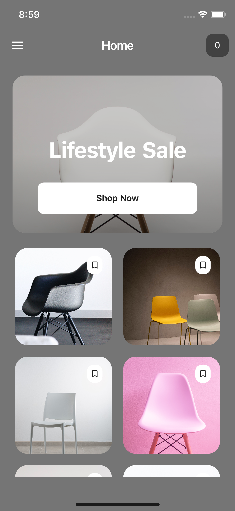
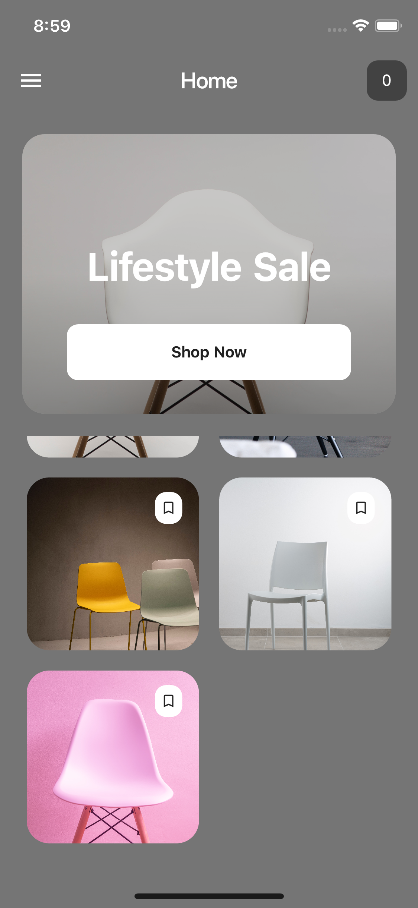

## Flutter GridView Example UI Design

Let's create a beautiful and animated GridView Example UI with Flutter.

### [Watch it on Youtube](https://youtu.be/sEXekxd_IdM)


## Development Setup
Clone the repository and run the following commands:
```
flutter pub get
flutter run
```

## ScreenShots

&nbsp;

## Structure du Projet

**lib/**: Contient le code source de l'application.
  - **main.dart**: Point d'entrée principal de l'application.
  
  - **pages/**: Contient les écrans de l'application.
    - **home_page.dart**: Page principale de l'application affichant une grille d'images avec des animations sur les boutons.

## Description des Fichiers

<details>
<summary>1.1 main.dart</summary>

- Ce fichier est le point d'entrée principal de l'application Flutter. Il initialise l'application en lançant la méthode `runApp()` avec le widget racine de l'application. Le widget racine est généralement un `MaterialApp` qui configure le thème, les routes, et la page d'accueil de l'application.

</details>

<details>
<summary>1.2 home_page.dart</summary>

- **_HomePageState** :
  Cette classe représente l'état de la page d'accueil de l'application. Elle contient une liste d'images `_listItem`, qui sont affichées sous forme de grille dans l'interface utilisateur. Chaque image est affichée avec un bouton animé en forme d'icône de signet (`bookmark`).

- **AppBar** :
  La barre d'application comprend une icône de menu à gauche, un titre centré, et une petite boîte à droite affichant "0". Cette boîte est stylisée avec un fond gris foncé et des coins arrondis.

- **Scaffold** :
  Utilisé pour structurer la page d'accueil, le `Scaffold` contient l'`AppBar`, une zone de contenu principale définie dans le `body`, et gère la structure globale de la page.

- **GridView** :
  Le `GridView.count` est utilisé pour afficher les images sous forme de grille avec 2 colonnes. Chaque élément de la grille est une carte (`Card`) contenant une image, stylisée avec des coins arrondis et une animation d'apparition d'un bouton de signet.

- **Image principale** :
  En haut de l'écran, une grande image est affichée avec un texte superposé ("Lifestyle Sale"). Cette section inclut un bouton "Shop Now", stylisé en blanc avec un texte gris foncé. Cette section est également stylisée avec un dégradé noir transparent pour un effet esthétique.

- **Bouton Signet** :
  Chaque image de la grille inclut un bouton en forme de signet. Ce bouton est initialement positionné en dehors de l'image (décalé de 50 pixels) et est animé pour apparaître sur l'image lorsqu'elle est affichée.

</details>

